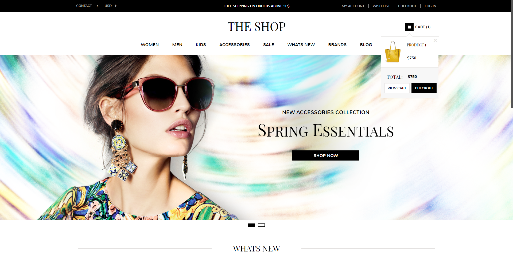

# 🛍️ The Shop


The Shop — это SPA для интернет-магазина одежды. Приложение написано на TypeScript + React + Redux Toolkit + React Router + styled-components.

## Функции
- **Каталог товаров** - с возможностью быстрого просмотра товара
- **Страница товара** - можно добавлять в корзину, выбирать цвет и размер, оставлять отзывы
- **Корзина** - с вычислением стоимости заказа и доставки
- **Личный кабинет** - создание и редактирование аккаунта
- **Идентификация и аутентификация пользователей**
- **Оплата заказа** - сохранение оплаченных заказов в личном кабинете
- **Список желаемых товаров**
- **Блог** - с возможностью комментировать статьи

## Установка
*Для установки и использования приложения необходима Node.js >= 14.0.0*

Клонирование репозитория и установка:
```
git clone https://github.com/nxiiln/the-shop.git
cd the-shop
npm install
```

## Использование
Запустить сервер разработки:
```
npm start
```

Сделать оптимизированную сборку:
```
npm run build
```
